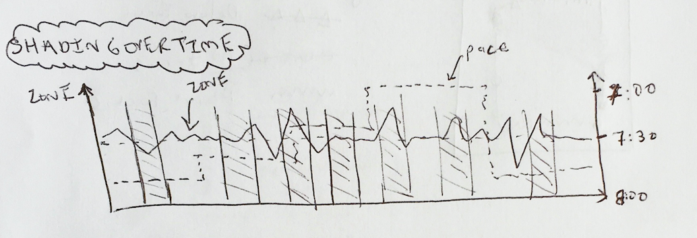
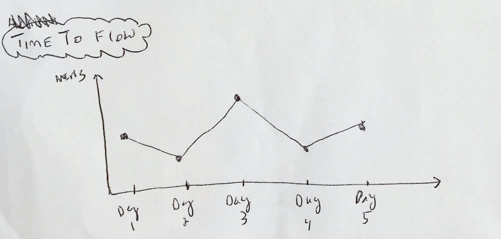

# Extra Mile - an MIT Reality Hack Project

## Team
Team name: *Extra Mile*

Team members: Michael Chen, Andreas Greiler-Basaldua, Tim Miller, Paris Nikitidis

## Problem We're Solving
- 65% of people give up on their workout plans within 3 to 6 months, in part due to a lack of sustained enjoyment during physical exercise (check/find source)
- It can be difficult to identify the right balance between challenge and enjoyment, especially for less experienced runners and runners with special conditions (disabilities, injuries etc.)
- 

*Extra Mile* leverages Arctop's neural interface technology and AR immersion to make running more fun and effective across 3 levers:
- **Gamification:** …
- **Pacer:** the pacer (overlayed in AR) leverages the user's real-time movement and biometric information (heart rate, enjoyment index, flow state index) to provide just the right pace at any point in the run - maximizing the time the user spends in 'flow state'
- **Self-coaching:** the mobile app lets the user track their progress and explore the relationship between athletic performance, enjoyment and physical health.

## Target user
*Caveat: the current size and weight of AR equipment isn't ideal for use during intense physical activity. This project serves as a proof of concept for technological opportunity space for nascent technologies.*

## Video
*link*

## Mobile App
The mobile application let's users review their progress and uncover the relationship between their running stats (distance run, pace, consistency) and biometric information (heart rate, enjoyment, flow state)

*insert drawings and Figma sketch*

  
   

## Future Applications & Limitations
POssible use cases based on our proof of concept...

  

# Appendix
- Technical Setup:

  

Edit here: https://docs.google.com/presentation/d/1g8JaWoVGWz28a8YdJW9EGLiUD4OwYZhRRUSxshJ9tng/edit?usp=sharing

- Scientific sources
Statistic on the amount of people who drop their exercise routine: https://www.nytimes.com/guides/smarterliving/how-to-start-exercising
On the relationship between pleasure during exercise and and contunued exercise: https://academic.oup.com/abm/article/49/5/715/4562772?login=false
- Arctop dummy data
