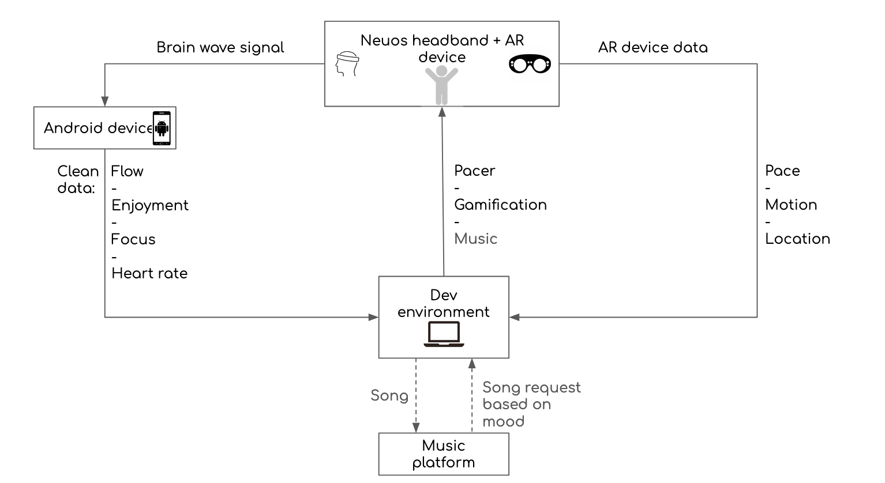
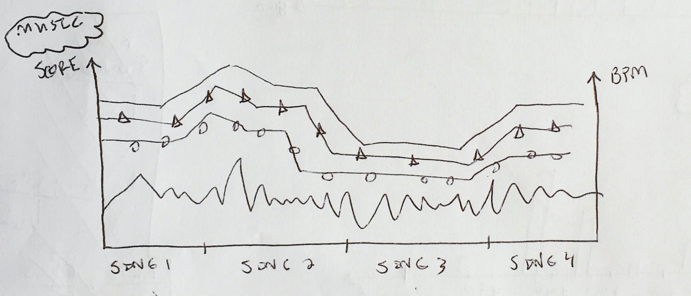

# ExtraMile - an MIT Reality Hack Project

## Team
Team name: *ExtraMile*

Team members: Michael Chen, Andreas Greiler-Basaldua, Tim Miller, Paris Nikitidis

  

## Problem Statement
- 65% of people give up on their workout plans within 3 to 6 months, in part due to a lack of sustained enjoyment during physical exercise and the delayed gratification (NYT & Rhodes et al.)
- It can be difficult to identify the right balance between challenge and enjoyment, especially for less experienced runners and runners with special conditions (disabilities, injuries etc.)

## Proposed Solution

*ExtraMile* leverages Arctop's neural interface technology and AR immersion (in this project we used Magic Leap) to make running more fun and effective across 3 levers:
- **Running companion:** the the running companion (overlayed in AR) leverages the user's real-time movement and biometric information (heart rate, enjoyment index, flow state index) to provide just the right pace at any point in the run - maximizing the time the user spends in 'flow state'
- **Gamification:** Real-time feedback (e.g. pacer avatar changes color during flow moments) provides instant gratification while exercising, and the mobile app helps the user set concrete goals.
- **Self-coaching:** the mobile app lets the user track their progress and explore the relationship between athletic performance, enjoyment and physical health.

## Target user
*Caveat: the current size and weight of AR equipment isn't ideal for use during intense physical activity. This project serves as a proof of concept for the technological opportunity space of nascent technologies.*

**Demographics**
- 32 y/o
- male/female
- lives in SF
- married with kid
- light cardio 2-3x a week

**Watering holes**
- frequent dinners and work events
- evening and weekend activities with tight-knit local friend group
- volunteers for affordable housing initiative in SF-monthly school parent meet ups
- hobbies: yoga, drawing

**Psychographics**
- hard working but seeks intrinsic joy in most activities
- long-term desire 
- busy with work, kids and volunteer committments: aims to be effective with their time
- cares about own mental and physical health, for themselves as well as family and friends

**Priorities**
- mental and physical health, for themselves as well as family and friends
- cares about financial stability, continuous self-improvement and a balanced lifestyle

## Technical Setup
The below diagram is the architecture for our project.

How to read the flow:
- User puts on AR headset and brain wave headband. They set target pace for running companion and begin to run.
- AR device begins capturing pace, distance traveled, and time elapsed. This information is continuously collected over the session and streamed directly to the heads up display.
- The AR device also projects running companion on the heads up display to help set the pace.
- The headband starts collecting brain wave data. The raw data is sent to the Neuos app. It is cleaned and transformed and then sends Flow, Enjoyment, Focus, and Heart Rate data to our custom Android app.
- The Android app then sends the data to a webserver so that it can be accessed by Unity.
- Our Unity app pulls in the brainwave data and determines whether or not to adjust the running companion. If the Flow, Focus, and Enjoyment are low, the app may slow down the running companion. Or the app may increase music BPMs to motivate the user. If the Flow, Focus, and Enjoyment are high the app may increase the pace to help the user get the most out of the workout.

  

## Product Demonstration
Below is a live demonstration of our product. The left screen shows a recording of our teammate running around with the device. The right screen shows what he sees through the AR device. The bottom screen shows the live brain wave data generated in through the brain wave headband.

*insert video demonstration*

## Mobile App
In the future we would develop a mobile application to let users review data collected during their activities. This app would focus on helping users discover the relationship between their running stats (distance run, pace, consistency) and biometric information (heart rate, enjoyment, flow state). Ideally this would integrate into fitness tracking apps like Strava.

Below are some screenshots of the sanple outputs this app would generate. Find an interactive version version here: https://www.figma.com/proto/ylttAtTAPtxABzNa4U6pkf/ExtraMile_Wireframe?page-id=225%3A1866&node-id=225%3A1867&viewport=241%2C48%2C0.71&scaling=scale-down

### Activity summary
Information collected for a *specific* activity. These views help a user understand how flow states varied over the course of the workout and how that correlates with performance.

  
  

### Monthly summary
Average flow score for an activity conducted on each day. The view helps show exercise conducted over a month and provides an overview of how flow states varied across all the activities.

## Future Applications & Limitations

### Future Applications
One possible expansion of our concept is an intergation with music, where the track is selected according to th most optimal BPM range at any point during the run.

  

### Limitations

## Appendix
Edit here: https://docs.google.com/presentation/d/1g8JaWoVGWz28a8YdJW9EGLiUD4OwYZhRRUSxshJ9tng/edit?usp=sharing

- Scientific sources
NYT, Statistic on the amount of people who drop their exercise routine: https://www.nytimes.com/guides/smarterliving/how-to-start-exercising
Rhodes et al., On the relationship between pleasure during exercise and and contunued exercise: https://academic.oup.com/abm/article/49/5/715/4562772?login=false
- Arctop dummy data
